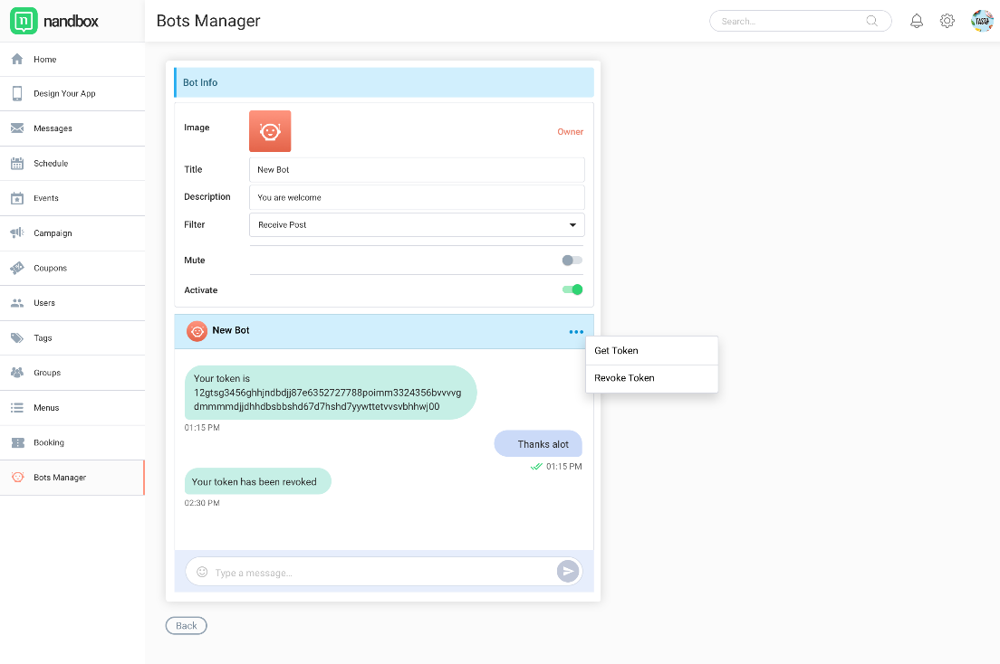

# ✅ **API/Bot Authorization Token**

Once you&#39;ve created an API/bot, you can obtain the API/bot&#39;s token by opening the bot for edit/chat and click "Get token" from top right overflow menu. The authorization token and API Server URL link will be sent within the bot chat window. The information will be used to connect your API/bot to API Server.


As the owner (creator) of the API/bot, you will have a chance to test the bot before publishing. As soon as the bot is tested successfully, you can publish the bot by pressing "publish" button. Within 24 hours, the bot will be published and available for bot public search index within your App only.

It is important to know that any change in the bot information will result the bot being unpublished, and the owner must publish his/her bot again to make it available for public search index.

```javascript
const TOKEN = "90091903321704167:0:pVB3qS7H3JBDVvxA9pRh4EQl8ObLVJ";
const config = {
    URI: "wss://w1.nandbox.net:5020/nandbox/api/",
    DownloadServer: "https://w1.nandbox.net:5020/nandbox/download/",
    UploadServer: "https://w1.nandbox.net:5020/nandbox/upload/"
}
```

<aside class="notice">
You must replace <code>TOKEN</code> in your bot code with the token you got earlier.
</aside>


