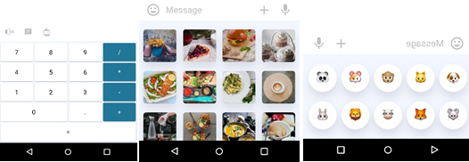
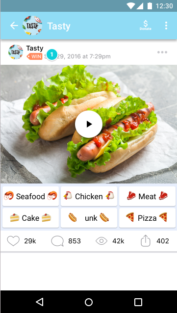
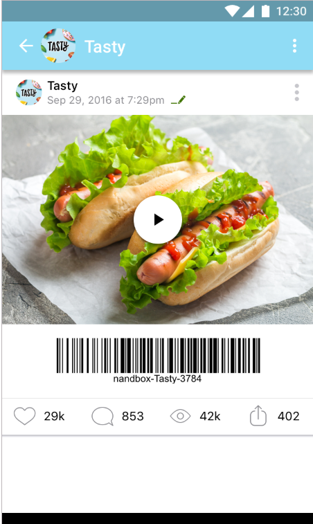
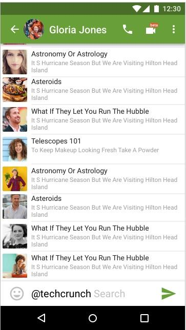

#  API Bot Features
## Keypad Menu Types
### Normal Keypad Menu
Whenever your bot sends a message, it can pass along a special keypad with predefined reply options. nandbox apps that receive the message will display your keypad to the user. Tapping any of the buttons will send the respective command. This way you can drastically simplify user interaction with your bot.
nandbox currently supports text and emoji for the buttons. Here are some custom keyboard examples:

### Inline Keypad Menu
There are times when you would prefer to do things directly within the chat, such as when the user is changing settings, is choosing from a selection (e.g. voting) or flipping through search results. In such cases you can use Inline Keypads that are integrated directly into the messages they belong to.
When callback buttons are used, your bot can update its existing messages (or just the keyboard) so that the chat remains tidy.

## Message Edit
Since Inline Keypad Menus do not send additional messages to the chat, it makes sense to give bots a way of manipulating existing messages, so that they don’t have to send a new message each time they need to update something. This helps reduce clutter and build more fluid interfaces.  All updated and edited messages will be marked with a small edit icon.

## API/Bot Types
### Chat API/Bot
Users can interact with chat bots directly by opening the API/bot chat, or indirectly by communicating with a bot within a group, channel, or App.
### Inline API/Bot
Users can interact with your bot via inline queries straight from the text input field in any chat, by typing the bot's handle and then a query.
Having received the query, your bot can return some results. As soon as the user taps one of them, it is sent to the user's currently opened chat. This way, users can request content from your bot in any of their chats, groups or channels.

## API/Bot Filter
Bots are frequently added to groups and/or channels in order to augment communication between human users, e.g. by providing news, notifications from external services or additional search functionality. In order to insure that the bot is not receiving messages not intended for it, you can configure a bot filter.

A bot running with a filter will not receive all messages that people send to the group. Instead, it will only receive:

- Messages that are posted by admins (for Channels/App only)
- Replies to the bot&#39;s own messages.
- Service messages (people added or removed from the Group, etc.)
- All or none.

This allows the bot developer to save a on resources, since they won&#39;t need to process irrelevant messages.

API/Bots added as admins to groups, channels or your App have disabled filters by default (i.e. bot admins always receive all messages unless they have a filter).

## Deep link

nandbox API/bots have a deep linking mechanism that allows for passing additional parameters to a menu button to start a chat. The API/bot menu button has an optional chat field that, when pressed, will automatically open the chat and initialize the bot.

## Location and Mobile Number

Some API/bots need extra data from the user to work properly. For example, knowing the user&#39;s location helps provide more relevant geo-specific results. The user&#39;s phone number can be very useful for integrations with other services, like banks, etc.

API/Bots can ask a user for their **location** and **phone number** using special buttons. Note that both phone number and location request buttons will only work after the user accepts and grants permission for such service.
